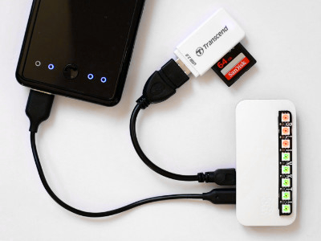

# Raspberry Pi Camera Import

These instructions transform a Raspberry Pi to an automatic headless photo import device for digital cameras and SD card readers.



## Features

When a digital camera or and SD card reader is plugged in the USB port, all new photos are copied to the Pi's SD card automatically. Use a reasonably large SD card and build a headless photo backup device.

The files are ordered by file date (usually the capture date):

`/mnt/pictures/2018-02-13/DSC01234.arw`

This way, the risk of duplicates is reduced (see "Limitations").

## Requirements

- Raspberry Pi with a free USB port
- Raspberry Pi OS 11 Lite (tested with version 2022-04-04)
- USB SD card reader or digital camera with USB mass storage support
- Optional: Piromoni Blinkt! for graphical status display

## Installation

Install a new Raspberry Pi OS image on the device and make sure it is connected to the network. The new device is assumed to be reachable by `camera-import.local`.

### Create a "pictures" partition

**Important:** Before the first boot (!), mount the "boot" partition (e.g. on another PC or Mac) and remove `init=/usr/lib/raspi-config/init_resize.sh ` from cmdline.txt. This allows a second, large, partition to be created.

Boot the device and log in, then add a partition:

```sh
# Use cfdisk to create a primary partition in the free space
sudo cfdisk /dev/mmcblk0

sudo mkfs.ext4 -L pictures /dev/mmcblk0p3
printf "LABEL=pictures\t/mnt/pictures\text4\tdefaults,noatime,ro\t0\t2\n" | sudo tee -a /etc/fstab > /dev/null
sudo mkdir /mnt/pictures
sudo mount /mnt/pictures
```

### Remove unused packages and daemons

```sh
# Disable Bluetooth and Audio
sudo systemctl disable bluetooth hciuart
echo "gpu_mem=16" >> /boot/config.txt
echo "dtparam=audio=off" >> /boot/config.txt
echo "dtparam=disable-bt" >> /boot/config.txt

# Disable swap
sudo dphys-swapfile swapoff
sudo dphys-swapfile uninstall
sudo systemctl disable dphys-swapfile

# Remove unused packages
sudo apt purge -y triggerhappy build-essential gcc-10 mkvtoolnix libc6-dev firmware-libertas firmware-atheros bluez gdb libc6-dbg manpages-dev dpkg-dev libraspberrypi-dev userconf-pi man-db

# Disable apt timers
sudo systemctl stop apt-daily.timer apt-daily-upgrade.timer
sudo systemctl disable apt-daily.timer apt-daily-upgrade.timer
sudo systemctl mask apt-daily.service apt-daily-upgrade.service
sudo systemctl daemon-reload

sudo apt autoremove --purge -y
```

### Install scripts and services

```sh
# Install packages
sudo apt install -y --no-install-recommends exfat-fuse python3-blinkt python3-psutil

# Fix python3-blinkt timing, see https://github.com/pimoroni/blinkt/pull/73 
sudo sed -i.backup 's/time.sleep(0.0000005)/time.sleep(0)/g' /usr/lib/python3/dist-packages/blinkt.py

# Install files
sudo install -m 0755 usr/local/bin/blinkt-clear /usr/local/bin/
sudo install -m 0755 usr/local/bin/blinkt-disk-usage /usr/local/bin/
sudo install -m 0755 usr/local/bin/camera-import-msd /usr/local/bin/
sudo install -m 0644 etc/systemd/system/blinkt-clear.service /etc/systemd/system/
sudo install -m 0644 etc/systemd/system/blinkt-disk-usage.service /etc/systemd/system/
sudo install -m 0644 etc/systemd/system/camera-import-msd@.service /etc/systemd/system/
sudo install -m 0644 etc/udev/rules.d/99-camera-import-msd.rules /etc/udev/rules.d/

sudo systemctl enable blinkt-disk-usage.service
sudo systemctl enable blinkt-clear.service

# Announce SSH service via Bonjour
sudo cp /usr/share/doc/avahi-daemon/examples/ssh.service /etc/avahi/services/ssh.service
```

### Enable overlay filesystem

Using `raspi-config`, enable "Overlay File System".

This allows the device to be switched off after transferring photos, without needing to properly shut down. The "pictures" partition is mounted read-write only during transfer, to minimize the risk of data loss if the device is switched off without being shut down.

## Limitations

- Only works with cameras that support USB mass storage mode.
- An older version had support for PTP through gphoto2, this may or may not work correctly.
- There could theoretically be filename duplicates. That usually is, when more than 10.000 photos are taken on the same day, or when backing up multiple cameras.
- When using an USB card reader, you may need to unplug and replug the card reader when changing cards.

## Optional Components

### Pimoroni Blinkt!

[Blinkt!](https://github.com/pimoroni/blinkt) is a pHAT stacking header for Raspberry Pi with 8 RGB LEDs. If it is installed, it is used for a simple status display:

- When idle, disk usage is displayed with red/green LEDs
- While copying, the progress is displayed [see video](https://www.youtube.com/watch?v=rcr646JgzJ4).
